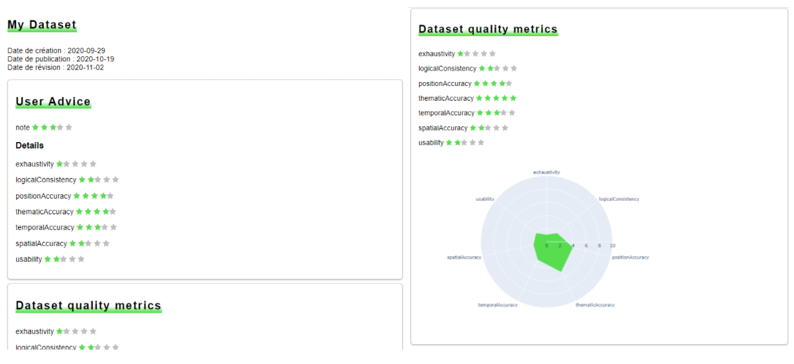

Le script `quadorender.py` est une preuve de concept de restitution de la qualité d'une donnée géographique d'après un fichier XML produit selon la norme ISO-19157.

## Installation
	pip install -r requirements.txt

## Script python
- [quadorender.py](quadorender.py) : script de rendu

## XML
Le XML a été produit selon plusieurs versions, selon le niveau d'avancement, et les fichiers réceptionnés

- [report-FR.xml](quadorender/fr/report-FR.xml) : rapport XML inspiré du Répertoire Français des Méta-données
- [report-19157.xml](quadorender/quadogeo-19157/report-19157.xml) : rapport XML inspiré de la norme ISO 19157
- [fake-dng2.0-iso.xml](quadorender/iso-19157/fake-dng2.0-iso.xml) : rapport XML de la norme ISO 19157

## Versions
Les scripts s'appuient sur différentes versions de XML

- [FR (Quadogeo) (première version)](quadorender/fr)
- [Inspiré de ISO-19157 (seconde version)](quadorender/quadogeo-19157)
- [ISO-19157 (troisième version)](quadorender/iso-19157)

## Exécuter le script
Par exemple, pour le script [ISO-19157](quadorender/iso-19157)

	python quadorender.py fake-dng2.0-iso.xml

## Sorties
- un rapport : [report.html](quadorender/quadogeo-19157/report.html)
- des graphiques à la volée d'extension  `.png` auxquels il est fait référence dans [report.html](report.html) ([seulement pour la version Inspirée de ISO-19157](quadorender/quadogeo-19157))

## Présentations
[Présentations](https://gitlab.cerema.fr/mathieu.rajerison/quadogeo/-/blob/master/README.md#pr%C3%A9sentations)
