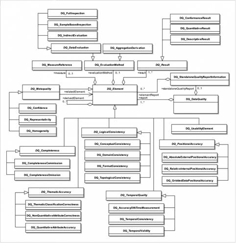

<!-- TOC start (generated with https://github.com/derlin/bitdowntoc) -->

- [Quadogeo](#quadogeo)
   * [1. QGIS](#1-qgis)
      + [Webinaire ARNIA - QGIS](#webinaire-arnia-qgis)
      + [Méthodes QGIS](#méthodes-qgis)
      + [Plugins QGIS](#plugins-qgis)
         - [Evaluation](#evaluation)
         - [Précision spatiale](#précision-spatiale)
         - [Cohérence topologique](#cohérence-topologique)
         - [Cohérence de format](#cohérence-de-format)
         - [Echantillonnage](#echantillonnage)
         - [Précision thématique](#précision-thématique)
         - [Réparation](#réparation)
         - [Auteurs de plugins liés à la qualité](#auteurs-de-plugins-liés-à-la-qualité)
      + [Méthodes sous Python ou PostGIS](#méthodes-sous-python-ou-postgis)
   * [2. Outil Quadorender (POC)](#2-outil-quadorender-poc)
   * [3. Ressources QuaDoGéo](#3-ressources-quadogéo)
      + [Fiches QuaDoGéo](#fiches-quadogéo)
      + [Mesures QuaDoGéo sur GéoCatalogue](#mesures-quadogéo-sur-géocatalogue)
      + [Webinaire et supports de formation Quadogeo](#webinaire-et-supports-de-formation-quadogeo)
         - [Evènement](#evènement)
         - [Supports QuaDoGéo](#supports-quadogéo)
      + [Remontée qualité](#remontée-qualité)
   * [4. Norme ISO-19157 officielle](#4-norme-iso-19157-officielle)
   * [5. Toronto Data Quality Score](#5-toronto-data-quality-score)
   * [6. Expressions régulières](#6-expressions-régulières)
   * [7. Statistiques](#7-statistiques)

<!-- TOC end -->

<!-- TOC -->
# Quadogeo

Répertoire d'outils et de méthodes associées au groupe de travail [QuaDoGeo du CNIG](http://cnig.gouv.fr/?page_id=18183) sur la qualité des données géographiques.

<!-- TOC -->
## 1. QGIS
<!-- TOC -->
### Webinaire ARNIA - QGIS

Webinaire ARNIA Idéo BFC 7 - Novembre 2023

[Mallette de formation QGIS](formation)  
[Antisèche QGIS](formation/cheatsheet.md)  
[Replay Qualité des données avec QGIS, PostgreSQL/PostGIS](https://ideo.ternum-bfc.fr/novembre-2023-classes-virtuelles-qualite-de-la-donnee)

<!-- TOC -->

### Méthodes QGIS
[Vérification et correction de géométries (MTE)](http://www.geoinformations.developpement-durable.gouv.fr/fichier/pdf/verification_et_correction_de_geometrie_v3_0_cle5fcd75.pdf?arg=177834719&cle=830634f7888fc808498f0c41704664611af04021&file=pdf%2Fverification_et_correction_de_geometrie_v3_0_cle5fcd75.pdf)

[Méthodes sous QGIS (en italien)](https://hfcqgis.opendatasicilia.it/gr_funzioni/gruppo_funzioni/)

<!-- TOC -->
### Plugins QGIS

<!-- TOC -->
#### Evaluation
- [QompliGIS](https://oslandia.com/2021/10/13/qompligis-un-plugin-pour-les-verifier-tous/)
- [Dataset QA Workbench](https://plugins.qgis.org/plugins/dataset_qa_workbench/)
- [vertex compare](https://plugins.qgis.org/plugins/vertex_compare/)
- [SenseHawk QC](https://plugins.qgis.org/plugins/sensehawk_qc/)
- [iso 19157](https://plugins.qgis.org/plugins/iso_19157/)
	- Site et doc' (en espagnol) : [http://iso19157qgis.hol.es/](http://iso19157qgis.hol.es/)

<!-- TOC -->
#### Précision spatiale
- [GeoPEC](https://plugins.qgis.org/plugins/geopec/) (précision spatiale de lignes)
- [AcAtaMa](https://plugins.qgis.org/plugins/AcATaMa/)
- [Qpositional](https://plugins.qgis.org/plugins/Qpositional/)
- [Accuracy Assessment](https://plugins.qgis.org/plugins/accassess/) (pour rasters)
- [Spatial Distribution Pattern](https://plugins.qgis.org/plugins/spatialdistributionpattern/)
- [BOS](https://plugins.qgis.org/plugins/BOS/) (comparaison de lignes)
- [LineComparison](https://plugins.qgis.org/plugins/linecomparison/)
- [vertex compare](https://plugins.qgis.org/plugins/vertex_compare/)
- [Nearest Neighbor Method for Linear Features (NNMLF)](https://plugins.qgis.org/plugins/nnmlf/)

<!-- TOC -->
#### Cohérence topologique
- [SQUAD Tool](https://plugins.qgis.org/plugins/squad-plugin-qgis2/)
- [SQUAD Tool v3](https://plugins.qgis.org/plugins/squad-plugin-qgis3/)
- [constraintchecker](https://www.lutraconsulting.co.uk/projects/constraintchecker/)
	- [Doc](https://www.lutraconsulting.co.uk/projects/constraintchecker/)
- [shp2grass\_checker](https://plugins.qgis.org/plugins/shp2grass_checker/)
- [frequency\_overlaps](https://plugins.qgis.org/plugins/frequency_overlaps/)
- [Geometry Validator](https://plugins.qgis.org/plugins/GeometryValidator/)

<!-- TOC -->
#### Cohérence de format
- [FormatConsistency](https://plugins.qgis.org/plugins/FormatConsistency/)
- [datetimetools](https://plugins.qgis.org/plugins/datetimetools/)

<!-- TOC -->
#### Echantillonnage
- [Sample by Features](https://plugins.qgis.org/plugins/SampleByFeatures/)
- [Sample by Area](https://plugins.qgis.org/plugins/SampleByArea/)

<!-- TOC -->
#### Précision thématique
- [thematic accuracy](https://plugins.qgis.org/plugins/thematic_accuracy/)

<!-- TOC -->
#### Réparation
- [prepair](https://plugins.qgis.org/plugins/prepair/)
- [RepairLinesConncetions](https://plugins.qgis.org/plugins/RepairLinesConncetions/)
- [RepairGeometry](https://plugins.qgis.org/plugins/RepairGeometry/)
- [vertex compare](https://plugins.qgis.org/plugins/vertex_compare/)

<!-- TOC -->
#### Auteurs de plugins liés à la qualité
- [Alex Santos](https://plugins.qgis.org/plugins/author/Alex%2520Santos/)
- [Harold Mercado Llanos](https://plugins.qgis.org/plugins/user/hmercado78/admin)

<!--
#### Par catégories
- Accuracy
	- https://plugins.qgis.org/plugins/tags/accuracy/
- iso : https://plugins.qgis.org/search/?q=iso
- prepair : https://plugins.qgis.org/plugins/prepair/
- quality
	- https://plugins.qgis.org/search/?q=quality
	- https://plugins.qgis.org/plugins/tags/quality/
- Spatial data quality
	- https://plugins.qgis.org/plugins/tags/spatial-data-quality/
- check
	- https://plugins.qgis.org/search/?q=check
	- https://plugins.qgis.org/plugins/tags/check/
- valid : https://plugins.qgis.org/search/?q=valid
- control : https://plugins.qgis.org/search/?q=control
- repair : https://plugins.qgis.org/search/?q=repair
-->

<!-- TOC -->
### Méthodes sous Python ou PostGIS
- https://medium.com/epfl-extension-school/advanced-exploratory-data-analysis-eda-with-python-536fa83c578a
- https://blog.cleverelephant.ca/2018/06/polygon-splitting.html

<!-- TOC -->
## 2. Outil Quadorender (POC)
[Quadorender, preuve de concept d'une restitution automatisée de la qualité](tooling/quadorender)

- [Quadorender sur un vrai XML ISO-191157 (Réunion du 7 Octobre 2021)](https://docs.google.com/presentation/d/1JLyhtKRqUqeOSJiULc1fYeCldKf3pZDN1cHfCfp-S5M/edit?usp=sharing)  
- [Quadorender sur un XML ISO-191157 fictif (Réunion du 20 Mai 2021)](https://docs.google.com/presentation/d/18nhTcNG3yMRsH8U5en4q56BwytKDEycApAB1HOnNDjc/edit?usp=sharing)  
- [Quadorender sur un XML inspiré de QuaDoGeo (Réunion du 2 Octobre 2020)](https://docs.google.com/presentation/d/1TCYm14_mcmfzSNTyCeLvuT42KIrhgTr3vMO6HzNbLOg/edit?usp=sharing)

<!-- TOC -->
## 3. Ressources QuaDoGéo
<!-- TOC -->
### Fiches QuaDoGéo
[La norme ISO-19157, en français, et simplifiée, déclinée en fiches](https://www.cerema.fr/fr/actualites/serie-fiches-cerema-qualifier-donnees-geographiques)  
[Télécharger les fiches](https://github.com/CEREMA/quadogeo/tree/master/resources/fiches-iso-19157)

<!-- TOC -->
### Mesures QuaDoGéo sur GéoCatalogue
[https://data.geocatalogue.fr/ncl/mesuresQuaDoGeo](https://data.geocatalogue.fr/ncl/mesuresQuaDoGeo)

<!-- TOC -->
### Webinaire et supports de formation Quadogeo
<!--

-->

<!-- TOC -->
#### Evènement
- Evènement : [https://www.crige-paca.org/formations-qualite-des-donnees-geographiques/](https://www.crige-paca.org/formations-qualite-des-donnees-geographiques/) (Evènement animé par Stéphane Rolle du CRIGE PACA et Mathieu Rajerison du Cerema)
- Rubrique QuaDoGéo : [https://www.crige-paca.org/projets/quadogeo/](https://www.crige-paca.org/projets/quadogeo/)

<!-- TOC -->
#### Supports QuaDoGéo

- [Généralités](https://www.crige-paca.org/wp-content/uploads/2021/12/vf_qualite_1cc.pdf)
- [Eléments de contexte](https://www.crige-paca.org/wp-content/uploads/2021/12/vf_qualite_2cc.pdf)
- [Exhaustivité](https://www.crige-paca.org/wp-content/uploads/2021/12/vf_qualite_3cc.pdf)
- [Cohérence logique](https://www.crige-paca.org/wp-content/uploads/2021/12/vf_qualite_4cc.pdf)
- [Position](https://www.crige-paca.org/wp-content/uploads/2021/12/vf_qualite_5cc.pdf)
- [Temporel](https://www.crige-paca.org/wp-content/uploads/2021/12/vf_qualite_6cc.pdf)
- [Précision thématique](https://www.crige-paca.org/wp-content/uploads/2021/12/vf_qualite_7cc.pdf)
- [Outils statistiques](https://www.crige-paca.org/wp-content/uploads/2021/12/vf_qualite_8cc.pdf)
- [Echantillonnage](https://www.crige-paca.org/wp-content/uploads/2021/12/vf_qualite_9cc.pdf)
- [Ressentir la qualité](https://www.crige-paca.org/wp-content/uploads/2021/12/vf_qualite_10mr_cc.pdf)

<!-- TOC -->
### Remontée qualité
- [La remontée qualité utilisateurs (4 Juin 2020)](https://docs.google.com/presentation/d/1QCJtAPdPrcjRj9KQZuyjjTQt4q-ZrH4tGYIh3JNODAc/edit?usp=sharing)
- [Qualité, usages et usagers, est-ce usant ? (21 Novembre 2019)](https://drive.google.com/file/d/1Lx3LKOPJJZOkxrm-kApcTmUiupYhQ5kD/view)

<!-- TOC -->
## 4. Norme ISO-19157 officielle

- [Norme ISO-19157 en XML](https://github.com/ISO-TC211/XML/tree/master/standards.iso.org.annotated/iso/19157)  
- [Site ICA](https://wiki.icaci.org/index.php?title=ISO_19157:2013_Geographic_information_-_Data_quality)

<!-- TOC -->
## 5. Toronto Data Quality Score
- [https://medium.com/open-data-toronto/towards-a-data-quality-score-in-open-data-part-1-525e59f729e9](https://medium.com/open-data-toronto/towards-a-data-quality-score-in-open-data-part-1-525e59f729e9)
- Script Quality Score : [https://github.com/open-data-toronto/framework-data-quality/blob/master/data_quality_score.ipynb](https://github.com/open-data-toronto/framework-data-quality/blob/master/data_quality_score.ipynb)

<!--
> "Today, however, catalogue size is less relevant primarily because it fails to measure progress towards the program’s vision of enabling anyone, anywhere, to improve life in Toronto with open data."

> from “how many?” to “how good?” “emphasizing quality over quantity” 

> High-quality data enables high-quality impact

1. Usability (38%): how easy is it to work with the data? Measured by 3 metrics:

- Proportion of columns with meaningful names
- Proportion of columns with a constant value
- Proportion of valid features (for geospatial datasets)

2. Metadata (25%): is the data well described? Measured by percent of metadata fields that have been filled out by the publisher.
3. Freshness (18%): how close to creation is publication? Measured by the time gap between published refresh rate v. actual (e.g. expected daily but it has been a week), and gap between last refreshed and today.
4. Completeness (12%): how much data is missing? Measured by proportion of empty cells in the dataset.
5. Accessibility (7%): is the data easy to access? Measured by whether the data can be accessed via the DataStore API — a freebie for the MVP, as it contains data from the DataStore only.

> Instead of reporting the score as a percentage we opted for medals because, at this stage, getting the overall concept right is more important than the specific number.

> Is not a measure for how accurate data is — that’s for publishers. 

Contact : https://twitter.com/CareduzTweets , opendata@toronto.ca

- https://medium.com/open-data-toronto/towards-a-data-quality-score-in-open-data-part-2-3f193eb9e21d
- https://open.toronto.ca/dataset/catalogue-quality-scores/

> C. Create an automatic scoring and delivery mechanism

> At the end of this, 4 goals were met. Goal C, automatic scoring, is halfway there: the scoring is done automatically via a script but, for the beta, it has to be run manually.

> We brought together a Data Quality Working Group to aid us with the ambiguous meaning of quality and validate our approach. It was composed of a diverse membership: multiple teams, users with a range of comfort around data, both data producers and consumers, and an array of wide-ranging perspectives including from outside our organization altogether.

> It quickly became evident that quality depends on the degree to which data fits its intended purpose 

> If interested, the algorithms tested were outlined in a paper comparing trade-offs in rank weighting methods: rank sum, rank reciprocal, sum and reciprocal, rank exponent, rank order centroid.

-->

<!-- TOC -->
## 6. Expressions régulières
[https://github.com/datagistips/memos/blob/main/regexes.md](https://github.com/datagistips/memos/blob/main/regexes.md)

<!-- TOC -->
## 7. Statistiques
- [Statistiques pour statophobes](https://perso.univ-rennes1.fr/denis.poinsot/Statistiques_%20pour_statophobes/STATISTIQUES%20POUR%20STATOPHOBES.pdf  )
- [https://fr.wikipedia.org/wiki/Loi_de_Fisher](https://fr.wikipedia.org/wiki/Loi_de_Fisher)
