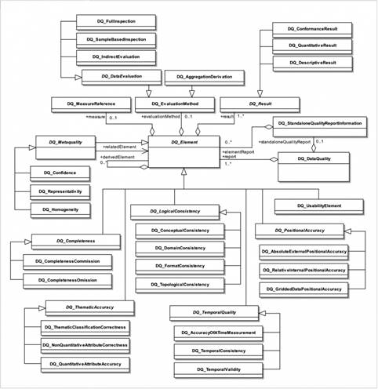

## Fiches Quadogeo ISO-19157
- [La norme ISO-19157, en français, et simplifiée, déclinée en fiches](https://www.cerema.fr/fr/actualites/serie-fiches-cerema-qualifier-donnees-geographiques)

## Mesures
### Norme ISO-19157
[Norme ISO-19157 en XML](https://github.com/ISO-TC211/XML/tree/master/standards.iso.org.annotated/iso/19157)  
[Site ICA](https://wiki.icaci.org/index.php?title=ISO_19157:2013_Geographic_information_-_Data_quality)
Modèle :

### Géocatalogue
[Catalogue des mesures de qualité QuaDoGeo
](https://data.geocatalogue.fr/ncl/_mesuresQuaDoGeo)

#### Caractéristiques de chaque mesure

- Nom
- Alias
- Critère / sous-critère
- Mesure de base
- Définition
- Description
- Paramètre
- Type de valeur
- Structure de la valeur
- Référence de la source
- Exemple
- Identifiant

## Quadorender
- [Quadorender sur un vrai XML ISO-191157 (Réunion du 7 Octobre 2021)](https://docs.google.com/presentation/d/1JLyhtKRqUqeOSJiULc1fYeCldKf3pZDN1cHfCfp-S5M/edit?usp=sharing)  
- [Quadorender sur un XML ISO-191157 fictif (Réunion du 20 Mai 2021)](https://docs.google.com/presentation/d/18nhTcNG3yMRsH8U5en4q56BwytKDEycApAB1HOnNDjc/edit?usp=sharing)  
- [Quadorender sur un XML inspiré de QuaDoGeo (Réunion du 2 Octobre 2020)](https://docs.google.com/presentation/d/1TCYm14_mcmfzSNTyCeLvuT42KIrhgTr3vMO6HzNbLOg/edit?usp=sharing)

## Remontée qualité
- [La remontée qualité utilisateurs (4 Juin 2020)](https://docs.google.com/presentation/d/1QCJtAPdPrcjRj9KQZuyjjTQt4q-ZrH4tGYIh3JNODAc/edit?usp=sharing)
- [Qualité, usages et usagers, est-ce usant ? (21 Novembre 2019)](https://drive.google.com/file/d/1Lx3LKOPJJZOkxrm-kApcTmUiupYhQ5kD/view)

## Ressources
https://hfcqgis.opendatasicilia.it/gr_funzioni/gruppo_funzioni/
http://www.geoinformations.developpement-durable.gouv.fr/fichier/pdf/verification_et_correction_de_geometrie_v3_0_cle5fcd75.pdf?arg=177834719&cle=830634f7888fc808498f0c41704664611af04021&file=pdf%2Fverification_et_correction_de_geometrie_v3_0_cle5fcd75.pdf
