<!-- TOC start (generated with https://github.com/derlin/bitdowntoc) -->

- [Exhaustivité](#exhaustivité)
   * [Données](#données)
   * [Donnée de contrôle](#donnée-de-contrôle)
   * [Utilisation de la transparence](#utilisation-de-la-transparence)
   * [Utilisation de masque](#utilisation-de-masque)
   * [Calcul de surface](#calcul-de-surface)
   * [Suppression des entités dupliquées](#suppression-des-entités-dupliquées)
   * [Réparer les géométries](#réparer-les-géométries)
   * [Différence symétrique](#différence-symétrique)
      + [Option](#option)
      + [Lacunes](#lacunes)
      + [Taux d'exhaustivité](#taux-dexhaustivité)

<!-- TOC end -->

<!-- TOC -->
# Exhaustivité

<!-- TOC -->
## Données
Projet QGIS : projet-plu-pertuis-INI.qgs

PLU (Couche de contrôle) : data\PLU-Pertuis\modif\PLU-Pertuis.gpkg

Couche de référence Commune : data\PLU-Pertuis\controle\pertuis-comm-bdparcellaire.gpkg

Couche de référence Parcelles : data\PLU-Pertuis\controle\pertuis-parcelles-bdparcellaire.gpkg

<!-- TOC -->
## Donnée de contrôle
- pertuis-comm-bdparcellaire.gpkg
- pertuis-parcelles-bdparcellaire.gpkg

<!-- TOC -->
## Utilisation de la transparence
On peut utiliser la transparence des objets sur la couche pour voir les excédents, les entités dupliquées

Aller sur la couche PLU

	Style de couche > Transparence

1  
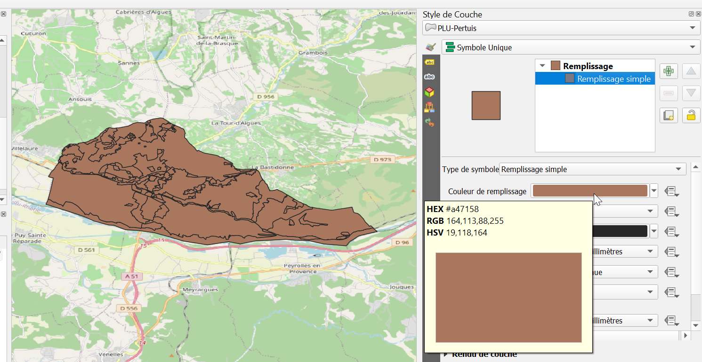

2  
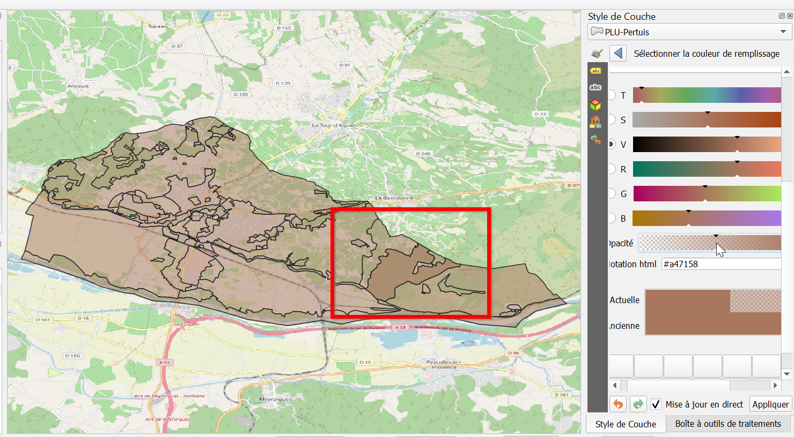

On voit une entité qui a été dupliquée. Cela fait un objet en plus/

<!-- TOC -->
## Utilisation de masque
La méthode du Noir et Blanc permet de voir les éléments excédentaires, ceux qui ne devraient pas être dans l'enveloppe de la couche

- Mettre la couche **Commune** en noir
- Mettre la couche **PLU** en blanc

On voit une entité en plus  
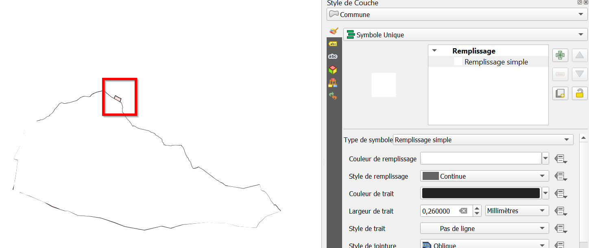

Les scories restantes, en bordure, semblent être issues de soucis de digitalisation. Ce ne sont pas des éléments en plus.

On a donc un objet dupliqué et un objet en plus, ce qui porte à 2 le nombre d'objets exédentaires.

<!-- TOC -->
## Calcul de surface
Comparer les surfaces de la référence avec celles de la couche à contrôler est également un bon moyen de repérer les soucis d'excédents.

On peut ajouter un champ virtuel `surface` à la couche PLU avec la formule suivante :

	area($geometry)

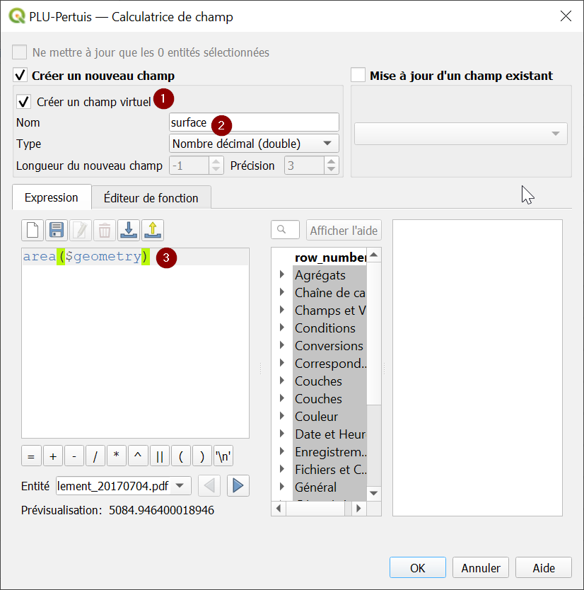

Mais en réalité, on peut avoir la somme des surfaces directement par le panneau en inscrivant la formule `area($geometry)`

	Vue > Panneaux > Statistiques > Somme des surfaces

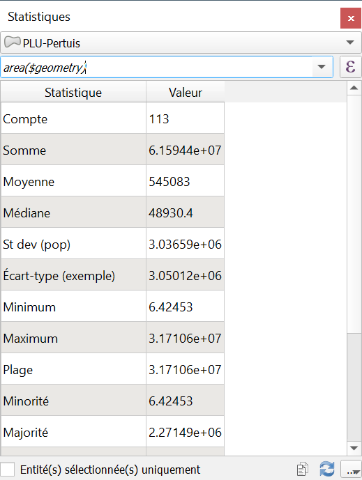

On a une surface d'environ 61 594 400 m²

On compare à la surface de la commune de la même façon. Celle-ci est de 59 427 500 m².

On peut aussi y accéder en interrogeant la couche

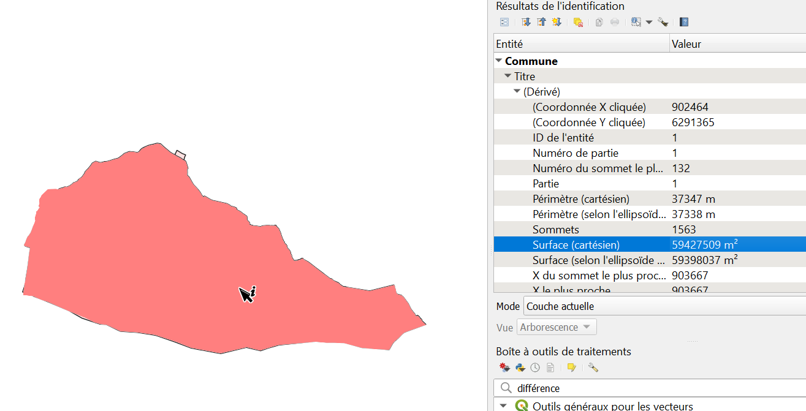

On a une différence d'environ 2 000 000 m² (20 ha) entre les deux couches, ce qui indique des excédents.

<!-- TOC -->
## Suppression des entités dupliquées
On peut supprimer les entités dupliquées comme ceci :

	Traitements > Supprimer les géométries dupliquées > PLU

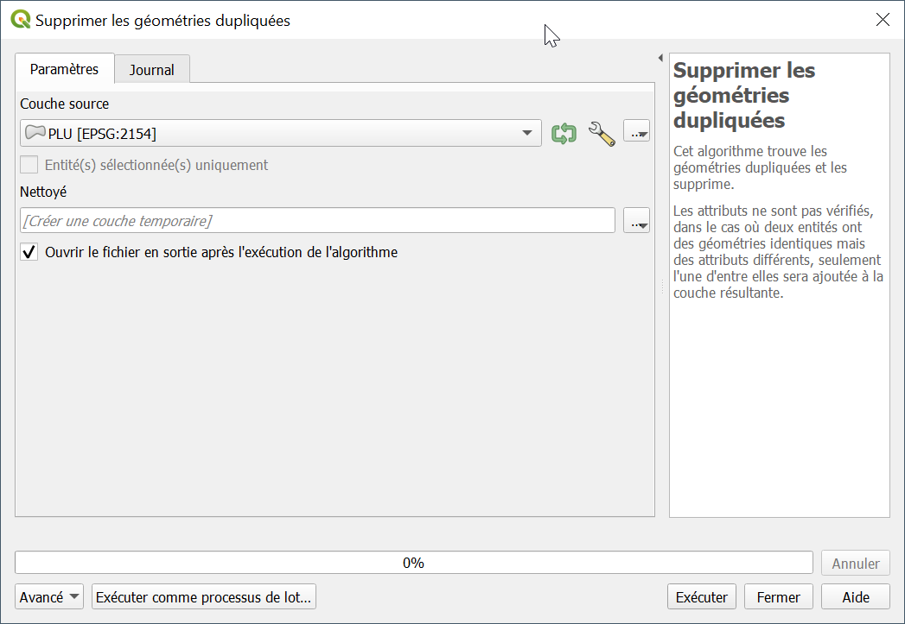

Malheureusement, le traitement provoque une erreur car la couche PLU comporte une erreur.

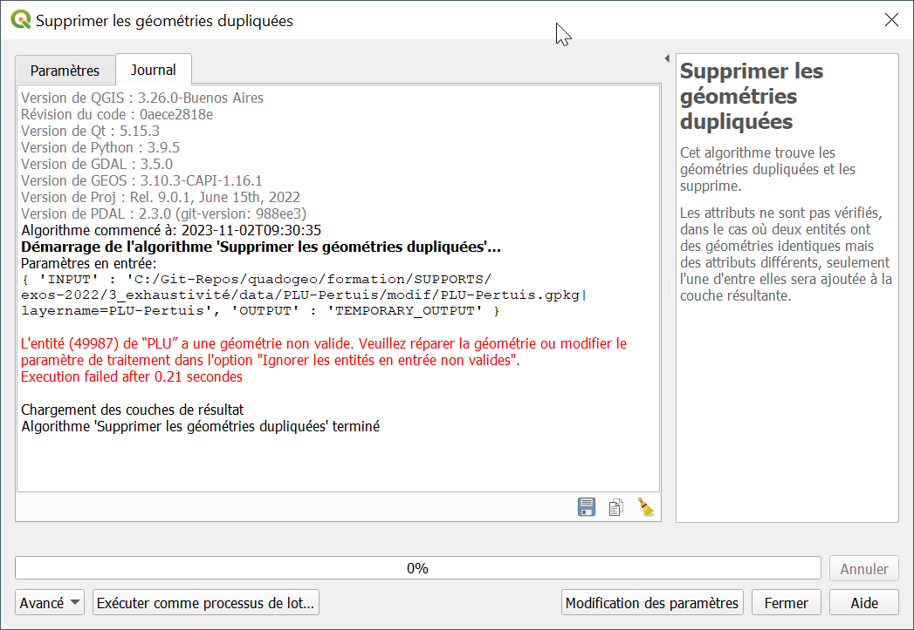

Il faut la réparer.

<!-- TOC -->
## Réparer les géométries
On crée la couche Réparé comme ceci

	Traitement > Réparer les géométries > PLU => Réparé

On peut ensuite appliquer la suppression des entités dupliquées

	Traitements > Supprimer les géométries dupliquées > Réparé > Nettoyé

On voit que les statistiques sont maintenant correctes

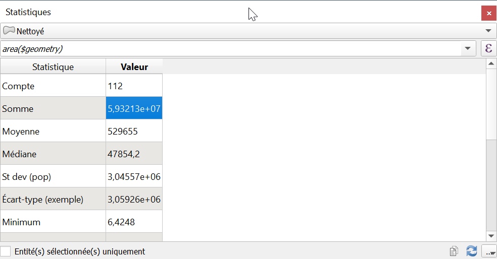

<!-- TOC -->
## Différence symétrique
La différence symétrique permet d'identifier :

- les éléments en excédent, qui ne devraient pas se trouver dans une certaine enveloppe définie par la couche de contrôle `Commune`
- les lacunes

	Traitements > Différence symétrique > Réparé x Commune => Réparé

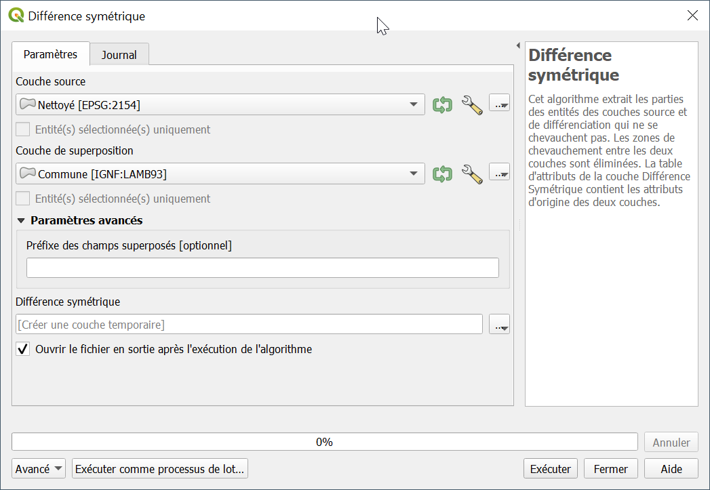

On obtient la couche `Différence symétrique`.

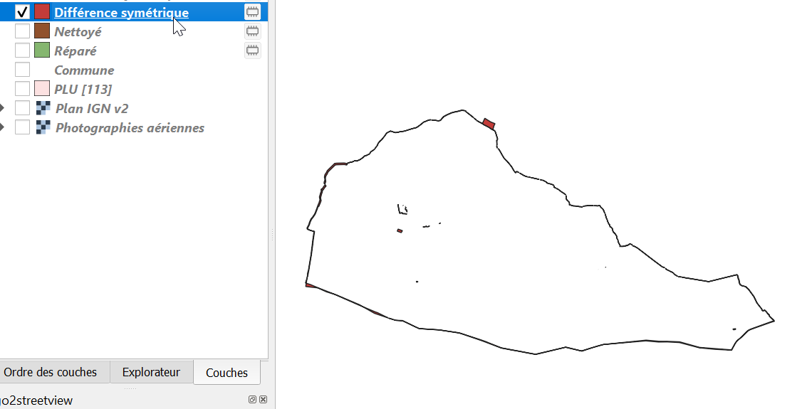

<!-- TOC -->
### Option
A noter que si nous n'avions pas réparé les géométries en amont, le traitement aurait provoqué une erreur sur la couche PLU, traitement `PLU x Commune`, à moins d'avoir appliqué un traitement visant à éviter les éléments invalides grâce à cette option

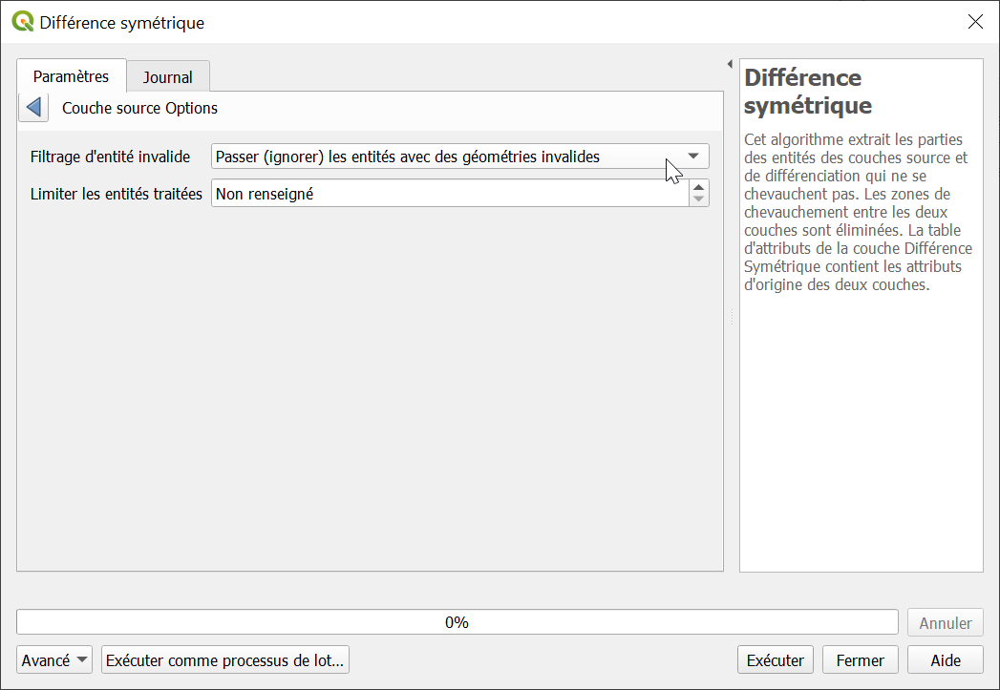

Le résultat aurait été très différent.

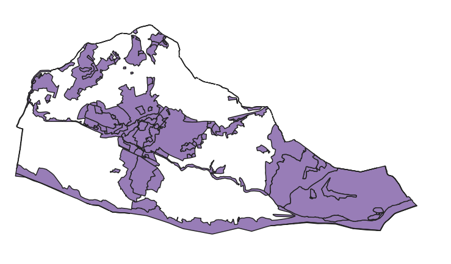

<!-- TOC -->
### Lacunes
Reprenons le résultat de notre différence symétrique et analysons-le :

Si on ajoute la couche Parcelles, on voit plusieurs choses.

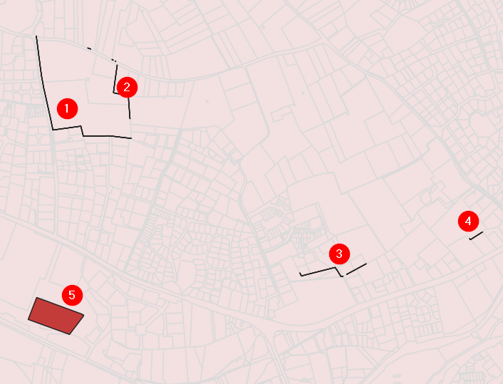

- Des scories (1) à (4) issues de la digitalisation, qui sont des lacunes ou interstices entre parcelles, qui ne doivent pas être considérées comme des éléments manquants, mais comme des soucis de cohérence logique, plus précisément topologique (voir le critère de cohérence logique)

- Un objet manquant (5)

On a donc un élément manquant.

En enlevant la couche de différenciation, on le voit apparaître :

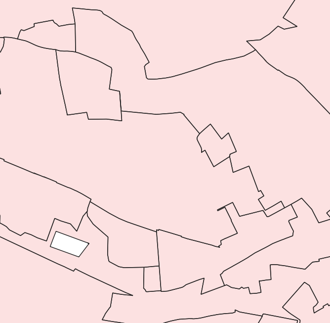

<!-- TOC -->
### Taux d'exhaustivité
Pour récapituler, nous avons :

- une entité dupliquée
- une entité en bordure, supplémentaire

Ce qui porte à 2 le nombre d'objets excédentaires.

Nous avons un objet manquant.

Voyons combien nous avons d'objets dans notre couche. Pour cela, tout simplement, allons dans 

	Contrôle des couches > PLU > Clic-droit > Voir le décompte des entités

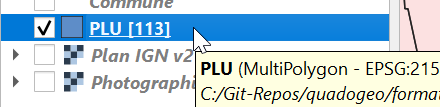

Nous avons 113 objets, mais en théorie, nous devrions avoir 

	113 - 2 (nb d'excédents) + 1 (nb d'objets manquants) = 111 objets.

Le taux d'erreur se compte comme

	(2+1) / 111 = 2,7%

Nous avons donc un taux d'exhaustivité de

	1 - ((2+1)/111) = 97,3 %

<!--
(Micro surface non comptée)
-->