<!-- TOC start (generated with https://github.com/derlin/bitdowntoc) -->

- [Domaine de valeurs](#domaine-de-valeurs)
   * [Données](#données)
   * [`destdomi`](#destdomi)
   * [`typezone`](#typezone)
   * [Taux de conformité](#taux-de-conformité)
   * [Valeurs uniques](#valeurs-uniques)
   * [Jointure](#jointure)
   * [Formatage conditionnel](#formatage-conditionnel)

<!-- TOC end -->

<!-- TOC -->
# Domaine de valeurs

<!-- TOC -->
## Données
Projet QGIS : 61_cohérence-logique-plu-pertuis-INI.qgz  
PLU : data\PLU-Pertuis\modif\PLU-Pertuis.gpkg  
typezone : data\PLU-Pertuis\controle\typezone.csv

<!-- TOC -->
## `destdomi`
Le fichier suivant listait les valeurs de référence pour le cham de destination dominante `destdomi`

Référence : https://www.geoportail-urbanisme.gouv.fr/image/180129_Standard_CNIG_PLU_v2017.pdf

Celles-ci ne pouvaient pas aller au delà de 10, sauf exception : 99 pour "Autre"

Nous allons voir si des valeurs de destdomi sont incorrectes dans la couche.

Aller dans

	Couche > PLU > Ouvrir la table d'attributs > Sélectionner les entités en utilisant une expression

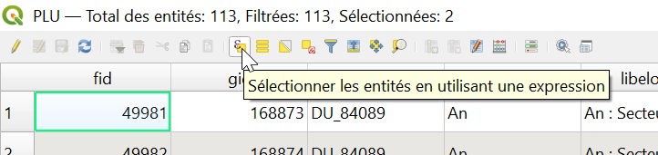

Taper la formule

	to_int(destdomi) > 10

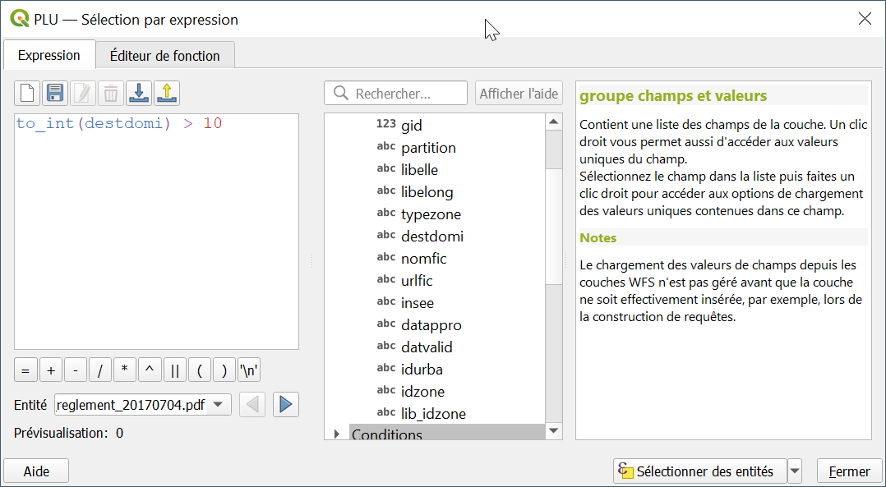

On a 2 valeurs incorrectes : 999 et 11

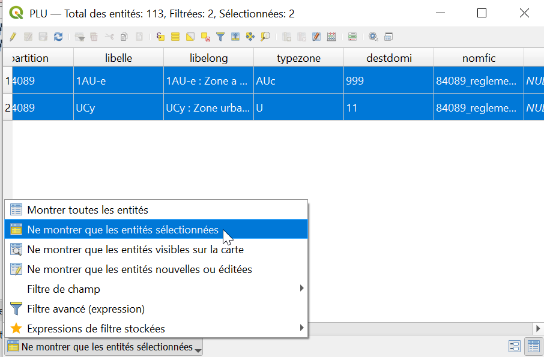

<!-- TOC -->
## `typezone`
Nous allons vérifier le champ `typezone`.

De la même façon, taper dans le fenêtre de sélection par expression.

	typezone NOT IN (
	'A',
	'AB',
	'AP',
	'AU',
	'N',
	'NA',
	'NB',
	'NC',
	'ND',
	'NE',
	'NH',
	'NI',
	'NL',
	'NP',
	'UA',
	'UB',
	'UC',
	'UCA',
	'UCB',
	'UD',
	'UP',
	'UE',
	'ZH',
	'U',
	'AUs',
	'AUc'
	)

En incluant les valeurs nulles

	... or typezone is NULL

Ce qui donne l'expression complète :

	typezone NOT IN (
		'A',
		'AB',
		'AP',
		'AU',
		'N',
		'NA',
		'NB',
		'NC',
		'ND',
		'NE',
		'NH',
		'NI',
		'NL',
		'NP',
		'UA',
		'UB',
		'UC',
		'UCA',
		'UCB',
		'UD',
		'UP',
		'UE',
		'ZH',
		'U',
		'AUs',
		'AUc'
		)
	
	or typezone is NULL

On a 5 objets mal classés.

<!-- TOC -->
## Taux de conformité
On a donc en tout :

- 2 objets avec une mauvaise valeur de destdomi
- 5 autres objets avec une mauvaise valeur de typezone

On a 7 valeurs non conformes.

On a 113 objets.

Le taux de conformité est de (113 - 7)/113 = 93,8%

<!-- TOC -->
## Valeurs uniques
A savoir qu'une fonction utile consiste à lister les valeurs uniques pour un champ donné

1  
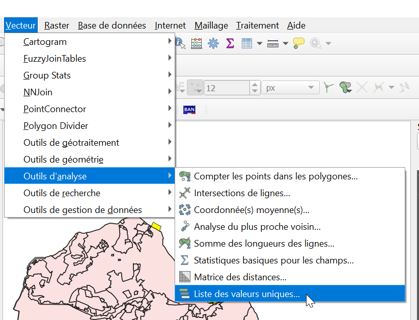

2  
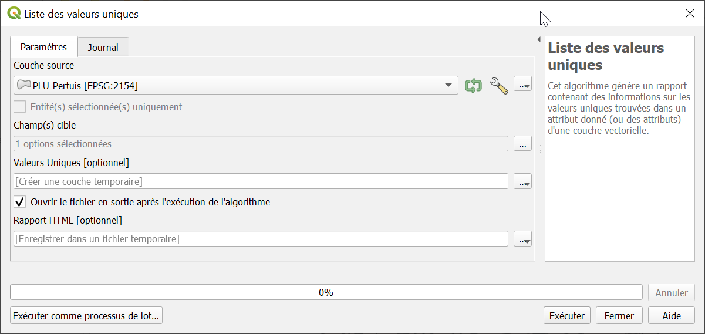

3  
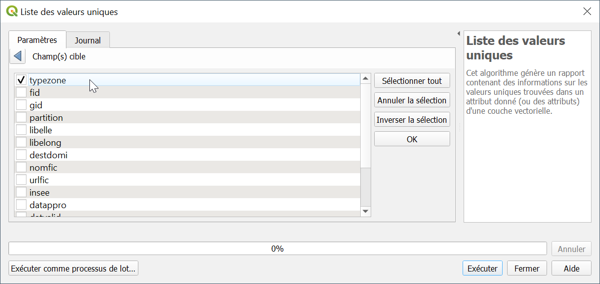

<!-- TOC -->
## Jointure
A noter que l'on peut s'appuyer sur une liste de valeurs de référence et une jointure pour voir les données conformes, plutôt que d'utiliser une expression

Aller dans la couche PLU et configurer la jointure avec typezone : PLU x typezone sur la base du champ typezone

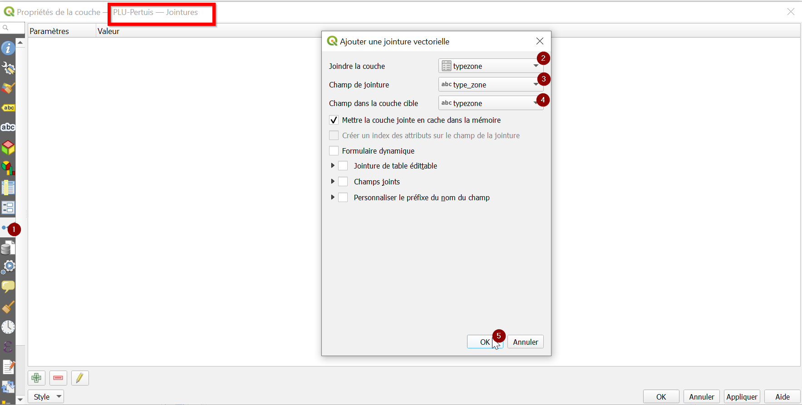

On voit que la colonne jointe est égale à NULL lorsque la valeur n'a pas été retrouvée dans typezone. C'est le cas de Z, Op (et NULL)

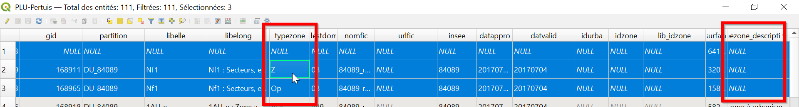

Pour sélectionner les lignes problématiques, on peut utiliser une expression basée sur le second champ description de typezone qui décrit le type de zone

	typezone_description is NULL

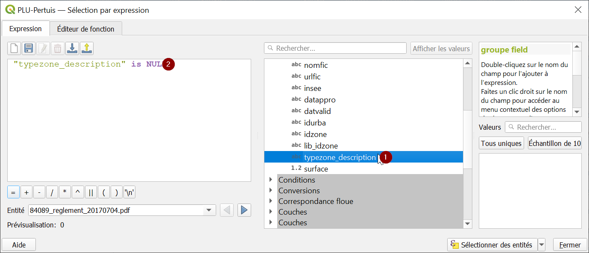

<!-- TOC -->
## Formatage conditionnel
On peut utiliser le formatage conditionnel pour afficher les lignes problématiques dans la couche PLU.

Aller dans la table d'attributs

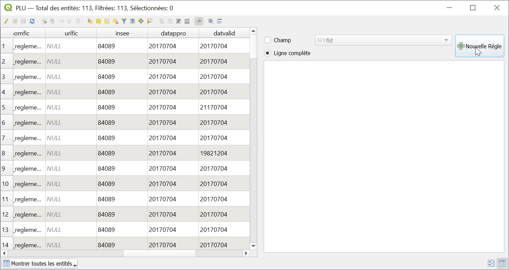

Dans la condition, utilisons l'expression précédente

	typezone NOT IN (
		'A',
		'AB',
		'AP',
		'AU',
		'N',
		'NA',
		'NB',
		'NC',
		'ND',
		'NE',
		'NH',
		'NI',
		'NL',
		'NP',
		'UA',
		'UB',
		'UC',
		'UCA',
		'UCB',
		'UD',
		'UP',
		'UE',
		'ZH',
		'U',
		'AUs',
		'AUc'
		)
	
	or typezone is NULL

Choisissez un réglage (ou choisissez vous-mêmes les couleurs de texte et d'arrière-plan)

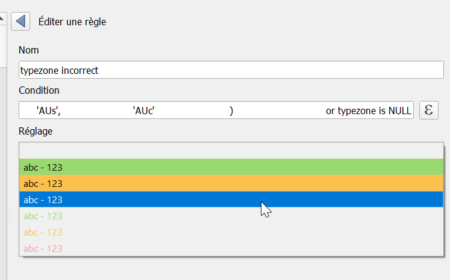

Cliquez sur Fait

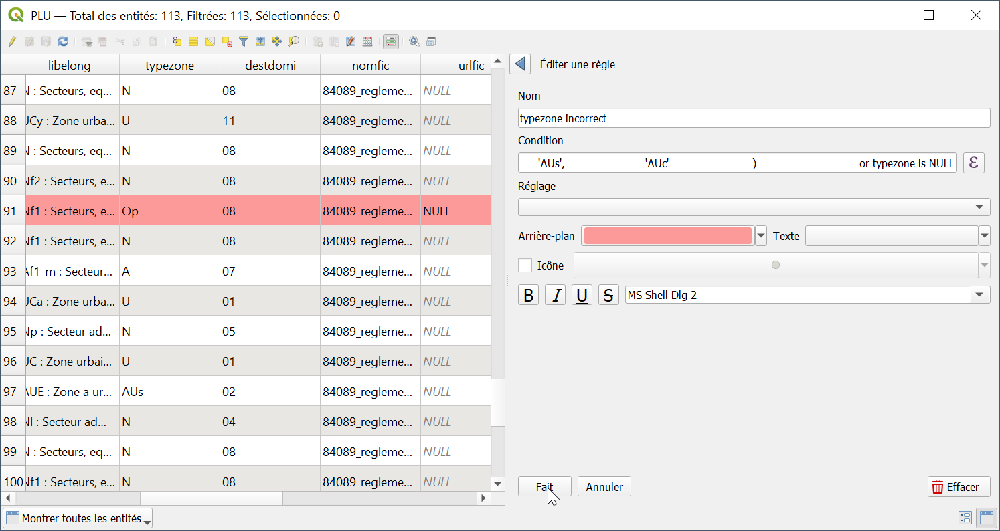

Les lignes se colorent en rouge si une erreur est présente.
