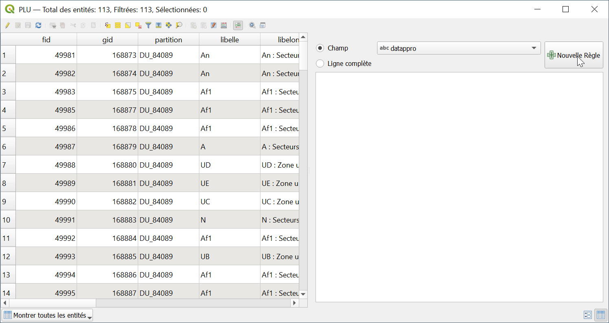
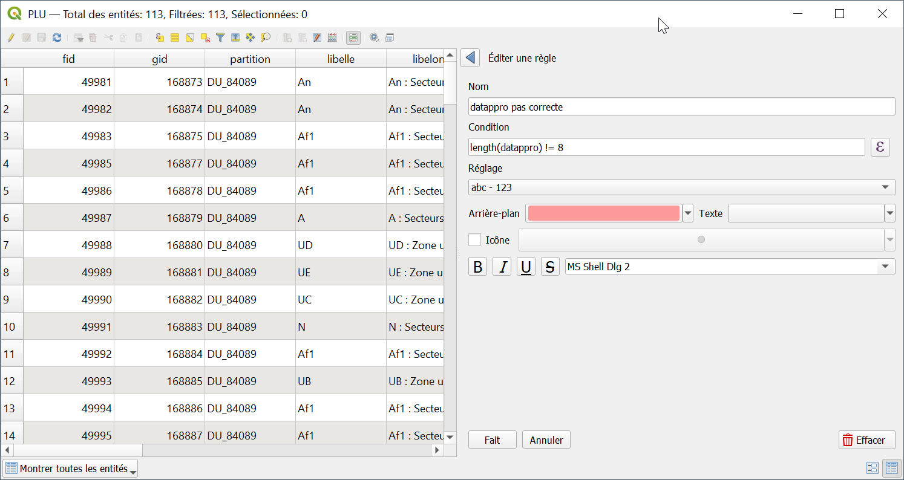
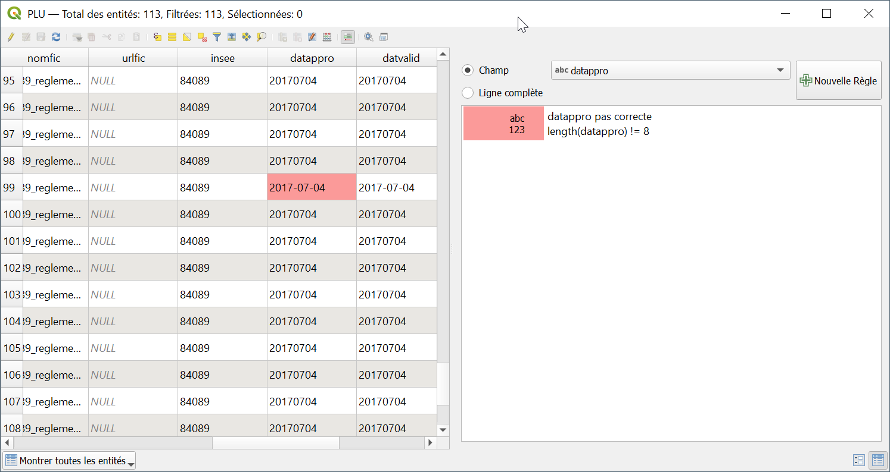
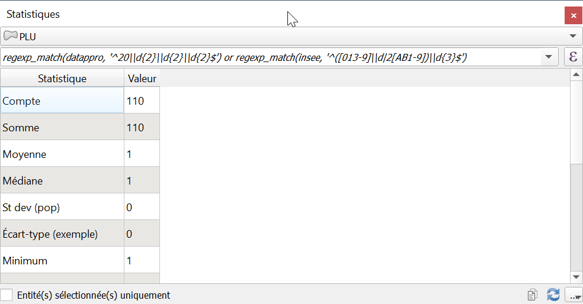

<!-- TOC start (generated with https://github.com/derlin/bitdowntoc) -->

- [Cohérence de format](#cohérence-de-format)
   * [Données](#données)
   * [Date](#date)
      + [Longueur](#longueur)
      + [Formatage](#formatage)
      + [Expression régulière](#expression-régulière)
   * [Code Insee](#code-insee)
      + [Expression régulière](#expression-régulière-1)
      + [Formatage conditionnel ](#formatage-conditionnel)
   * [Vue statistiques](#vue-statistiques)

<!-- TOC end -->

<!-- TOC -->
# Cohérence de format

<!-- TOC -->
## Données
Projet : 61_cohérence-logique-plu-pertuis-INI.qgz  
Donnée : PLU data\PLU-Pertuis\modif\PLU-Pertuis.gpkg

<!-- TOC -->
## Date
<!-- TOC -->
### Longueur
Une date mal écrite aura une longueur différente de 8.

Par exemple, une date aura comme valeur `20231103`
	
	- Année, ex. 2023 = 4 caractères
	- Mois, ex. 11 = 2 caractères
	- Jour, ex. 03 = 2 caractères

Comme pour l'exo cohérence au domaine de valeurs, allez dans 

	Couche > Ouvrir la table d'attributs > Sélectionner les entités en utilisant une expression

Tapez l'expression suivante :

	length(datappro) != 8

<!-- TOC -->
### Formatage
Aussi, vous pouvez utiliser le formatage conditionnel, mais sur la **cellule**.

Remplacer @value par l'expression

	length(datappro) != 8

Voilà le résultat

<!-- TOC -->
### Expression régulière
De manière plus fine, dans la sélection, des expressions régulières peuvent être utilisées :

Seulement des chiffres

	regexp_match(datappro, '^\\d{8}$')

21e siècle (années 2000)
	regexp_match(datappro, '^20\\d{2}\\d{2}\\d{2}$')

<!-- TOC -->
## Code Insee
Pour le code INSEE, une sélection peut être opérée de la même façon

	length(insee) != 5

<!-- TOC -->
### Expression régulière
On peut aussi utiliser une expression régulière (elle est assez sophistiquée)

	regexp_match(insee, '^([013-9]\\d|2[AB1-9])\\d{3}$')

<!-- TOC -->
### Formatage conditionnel 
On peut enfin opérer une sélection de mauvais formats, à la fois pour datappro, insee sur sur la **ligne complète**

	regexp_match(datappro, '^20\\d{2}\\d{2}\\d{2}$') or regexp_match(insee, '^([013-9]\\d|2[AB1-9])\\d{3}$')

<!-- TOC -->
## Vue statistiques
A savoir que la vue `Statistiques` peut être utile pour décompter les lignes problématiques

	Vue > Panneaux > Statistiques > PLU > Expression > regexp_match(datappro, '^20\\d{2}\\d{2}\\d{2}$') or regexp_match(insee, '^([013-9]\\d|2[AB1-9])\\d{3}$')

On a 110 lignes qui sont OK

