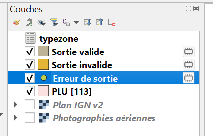
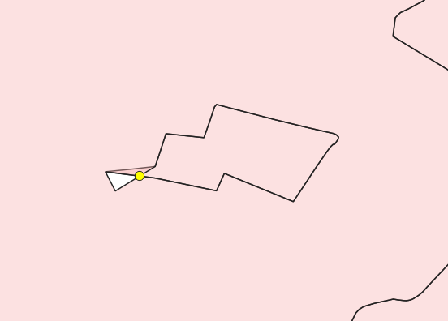
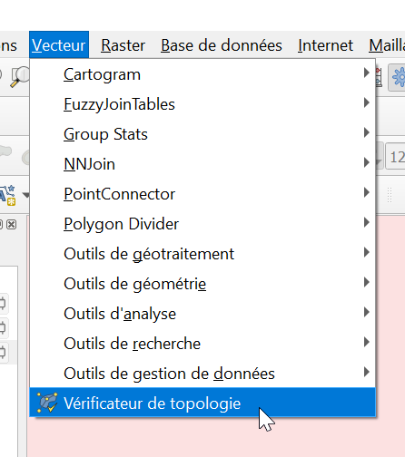
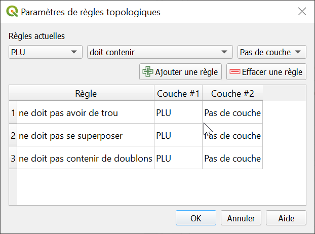
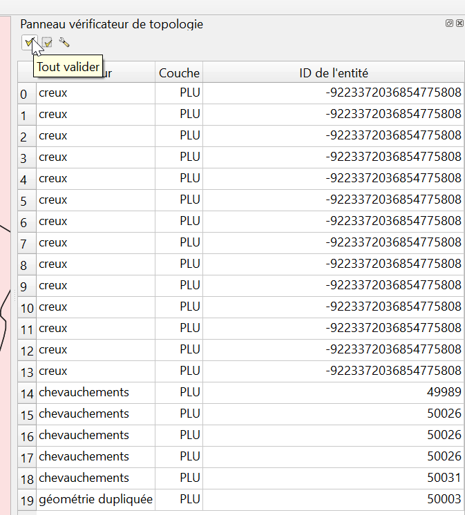
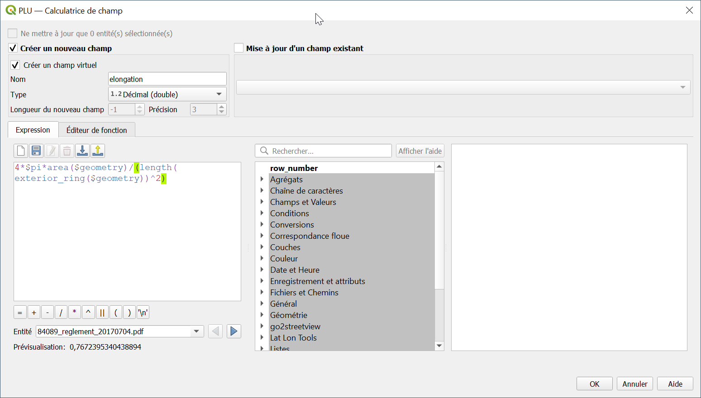

# Topologie

Projet : 61_cohérence-logique-plu-pertuis-INI.qgz  
Donnée : PLU data\PLU-Pertuis\modif\PLU-Pertuis.gpkg

## Auto-intersections
Les auto-intersections sont des erreurs de digitalisation en forme de papillons

Pour les voir, aller dans 

	Traitement > Vérifier la validité > PLU

Cela nous donne plusieurs couches, dont les erreurs de sortie

Voyons l'erreur de plus près. C'est une auto-intersection

> Blague : activer l'option `skip feature` ;-)

## Doublons, trous, recouvrements
Pour voir les doublons, les trous ou lacunes, les recrouvrements, on utiliser le `Vérificateur de topologie`

Dans un premier temps, il faut l'activer

	Plugins/Extensions > Vérificateur de topolgie > Installer l'extension

Allez dans

	Vecteur > Vérificateur de topologie

Ajoutez les règles :

- `Ne doit pas avoir de trou`
- `Ne doit pas contenir de doublons`
- `Ne doit pas se superposer` (sélectionne la même couche)

Exécutez

Double-cliquez sur chaque erreur pour aller dessus

## Micro-surfaces
Pour repérer les micro-surfaces, c'est très simple, allez dans la sélection par expression et tapez

	area($geometry) < 100

### Formes trop allongées
En aparté, certaines géométries non conformes peuvent avoir une forme très allongée. Pour calculer l'élongation d'un objet, entrez l'expression suivante, par exemple dans un champ virtuel avec un champ `elongation`

	4*$pi*area($geometry)/(length(exterior_ring($geometry))^2)

Et sélectionnez par tri celles qui ont le coefficient le plus faible