# GRASS

Projet : 61_cohérence-logique-plu-pertuis-INI.qgz  
Donnée : PLU data\PLU-Pertuis\modif\PLU-Pertuis.gpkg

L'outil GRASS est un outil offrant des fonctions de toplogie très performantes. GRASS n'accepte pas les données topologiquement et opère un nettoyage de la donnée avant l'intégration dans son environnement.

## Création d'un jeu de données GRASS

1 Allez dans

	Extensions > GRASS > Nouveau jeu de données
 
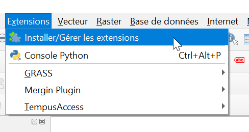

2

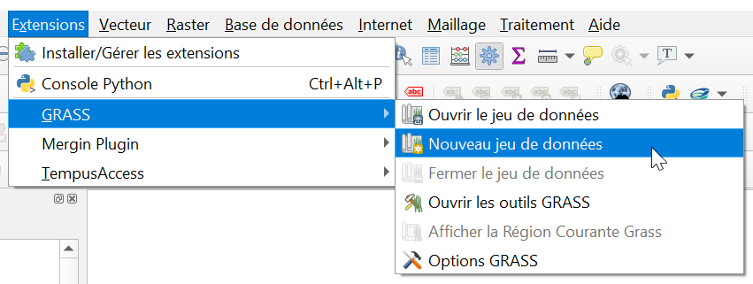

3 Choisissez un endroit où enregistrer votre jeu de données  

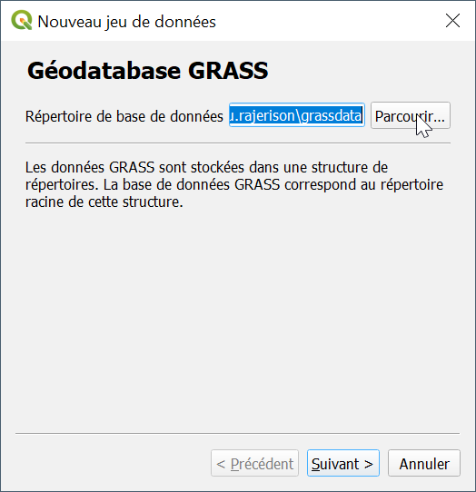

4 Créez un secteur (location)  

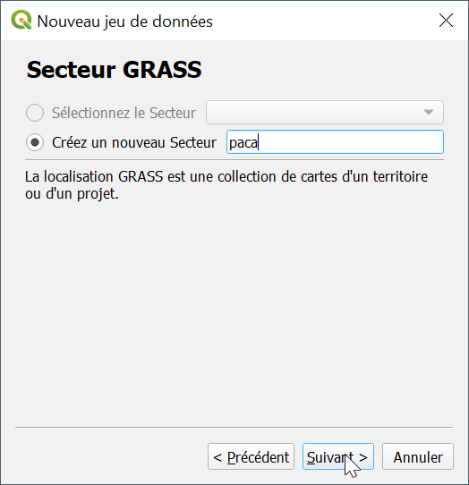

5 Choisissez un système de projection, ici RGF93  

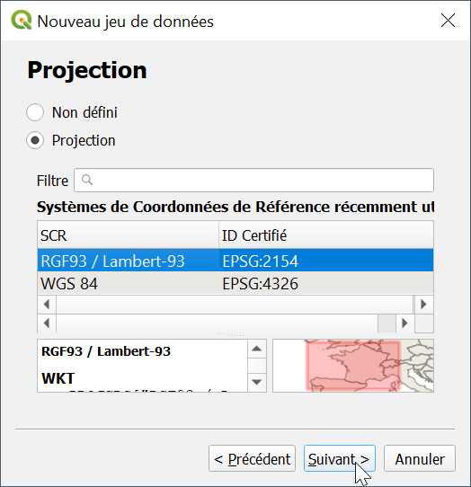

6 Choisissez une région de travail pour GRASS (emprise par défaut)  

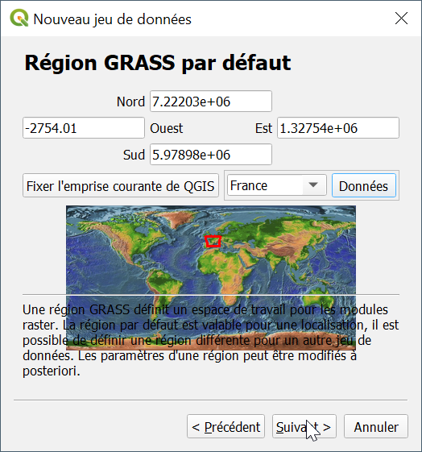

7 Nommez votre jeu de données   

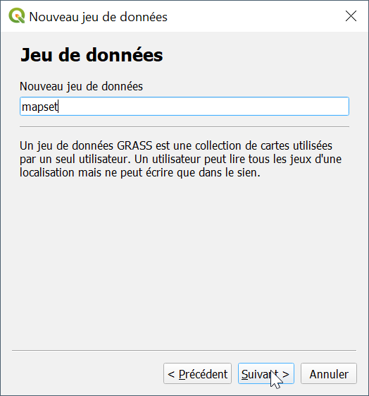

8 C'est bon, votre environnement est configuré  

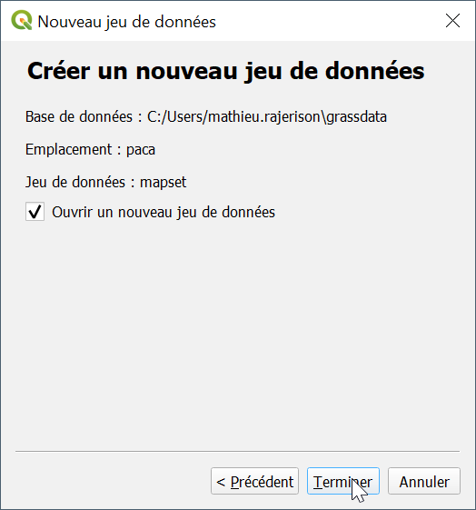

## Import
1 Ajoutez la couche `plu_pertuis`

2 Allez dans 

	Extensions > GRASS > Ouvrir les outils GRASS

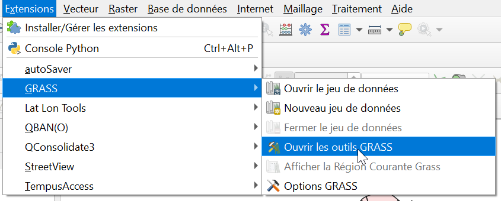

3 Choisissez l'outil `v.in.ogr.qgis`

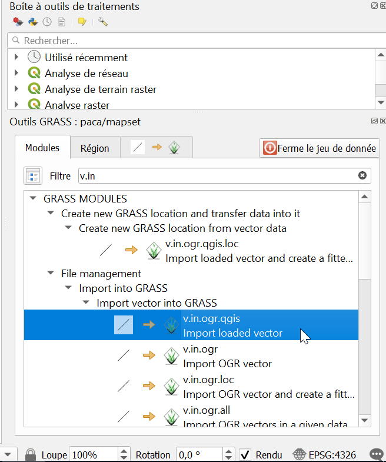

4 Importez le jeu de données : `plu_pertuis`

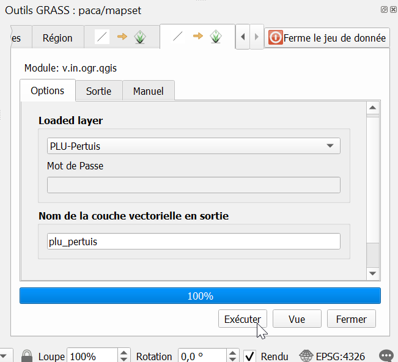

## Visualisation des lacunes et recouvrements

1 Allez dans

	Vue > Panneaux > Explorateur

Puis dans

	GRASS > paca > mapset > plu_pertuis

2 A l'import, plusieurs couches sont créées

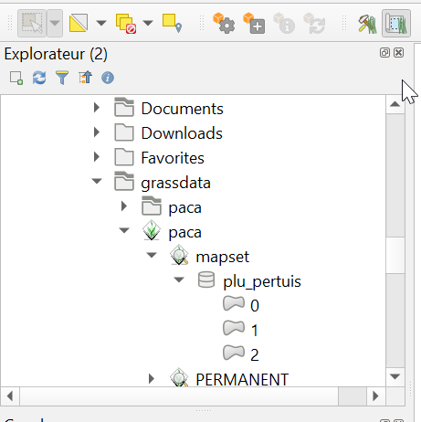

3  La **couche 2** correspond aux **recouvrements**. Ici, il s'agit de l'entité dupliquée et de quelques micro-surfaces recouvertes par des voisines.

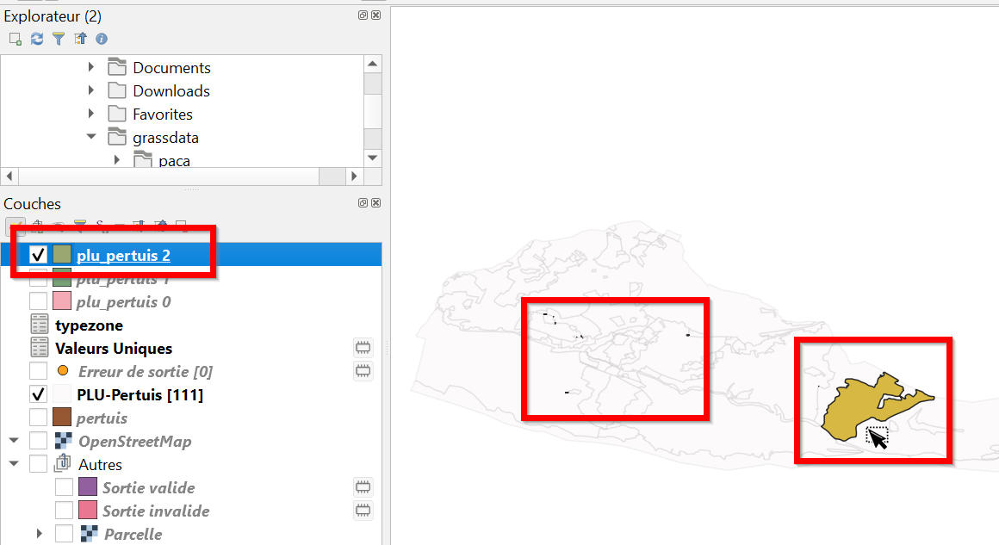

4 La **couche 0** correspond à des **lacunes**, des espaces interstitiels issus de l'omission d'un objet ou bien d'une mauvaise gitialisation topoloqie
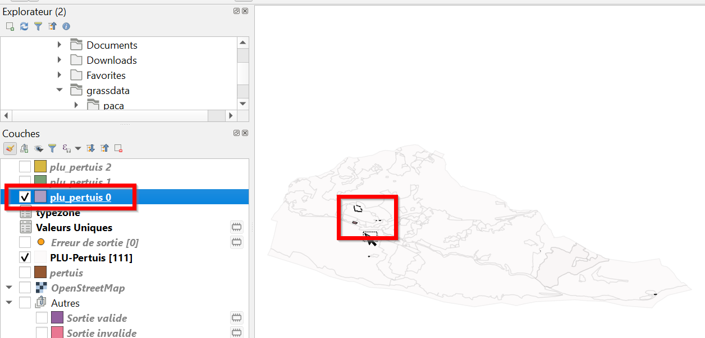