# Position

Jeux de données : 

De contrôle (à contrôler) : boulodromes (`data\equipco\controle\boulodromes.gpkg`)  
Référence : equipco (`data\equipco\modif\equipco.gpkg`)

Nous allons vérifier la conformité de positionnement des boulodromes de la couche à contrôler boulodromes

Projet QGIS : `71_position_boulodromes.qgz`

On peut télécharger les boulodromes de référence depuis EquipCo à ces adresses :

- https://trouver.crige-paca.org/dataset/equipements-collectifs-publics
- https://trouver.datasud.fr/dataset/equipements-collectifs-publics-de-provence-alpes-agglomeration

## Fonctions utilisées
	distance(), get_feature(), geometry()

## Boulodromes (points)
**Filtrer** EQUIPCO pour avoir les boulodromes sur equipco

	Couche > Filtrer...

Appliquer l'expression

		lib_niv3 = 'Boulodrome'

Cela donne `equipco_boulodromes`

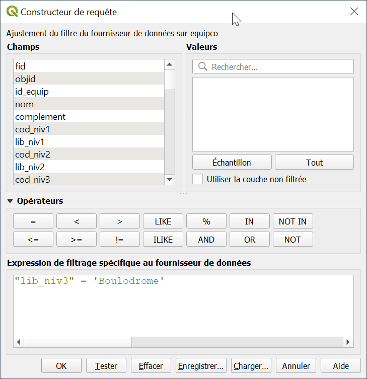

## Stylisation
1 Styliser les boulodromes de la couche de référence `equipco_boulodromes` en vert, de façon à ce qu'elles ressemblent à des boules de pétanque

	Couche > boulodromes > Propriétés > Style > Générateur de géométrie

Appliquez l'expression suivante

	buffer($geometry, 3) en mm

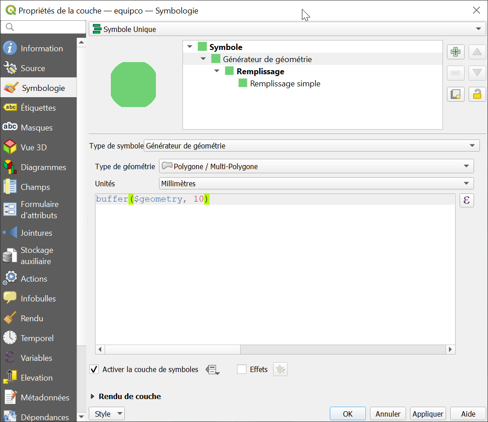

Dans le style, mettre

	motif de lignes > dupliquer pour horizontal

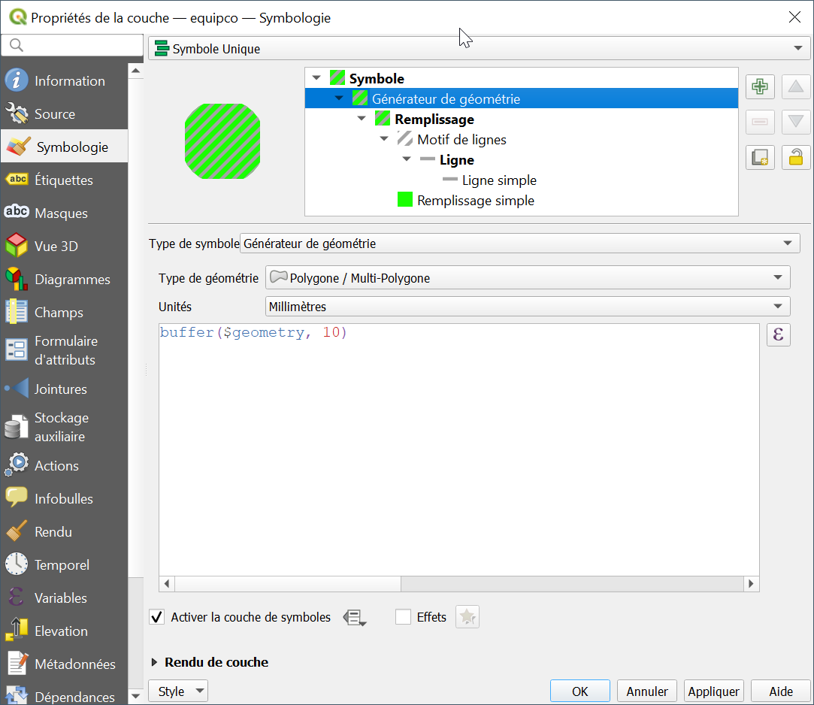

Appliquez un effet de lumière intérieure

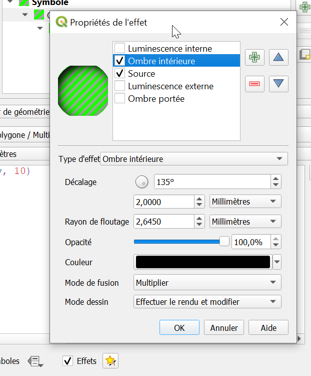

2 Styliser les boulodromes de la couche de contrôle `boulodromes` en rouge

	equipco_boulodromes > Copier le style > Coller le style sur boulodromes

3 Voilà le résultat

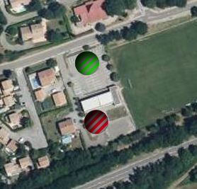

## Contrôle
On peut parcourir les différents objets de boulodromes en allant dans la table attributaire et en se mettant en vue formulaire

	Table attributaire > Vue formulaire > Croix de déplacement

- On voit des décalages

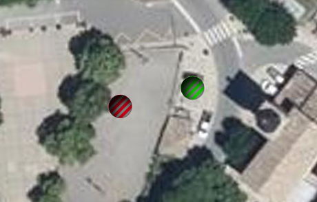

## Distances

Nous allons déterminer la distance entre les boulodromes de la couche de contrôle de deux façons différentes.

### Avec l'extension NNJoin
Installez `NNJoin`

	Extensions > Installer / Gérer les extensions > NNJoin

Utilisez NNJoin

	Vecteur > NNJoin > boulodromes x equipco_boulodromes 

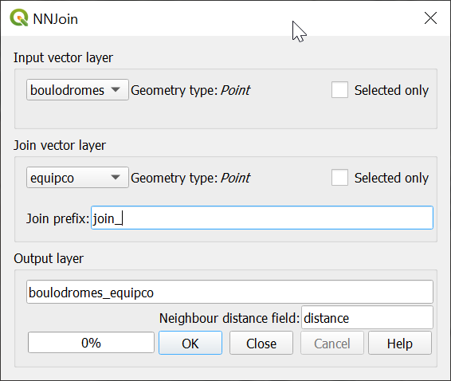

Cela donne la couche `boulodrome_equipco`.

Celle-ci a un champ `distance` sur laquelle nous verrons comment calculer certaines statistiques

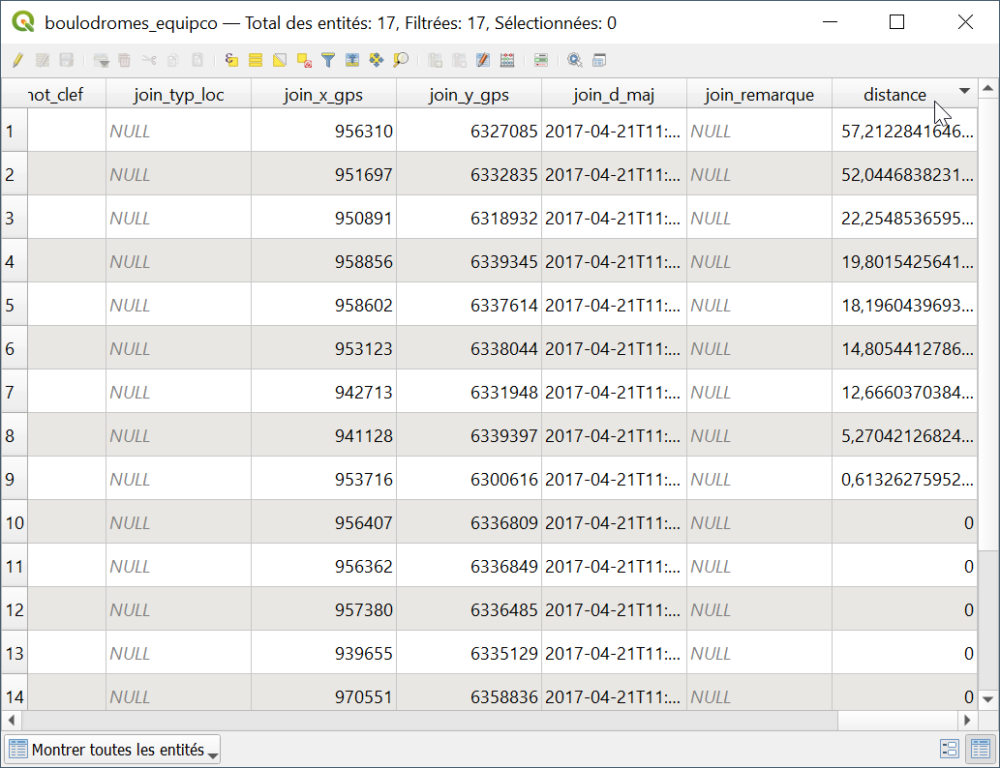

### Avec une expression
On crée un champ virtuel `distance` dans `boulodromes`

	boulodromes > Couche > Propriétés > Champ > Ajouter champ virtuel > distance

avec cette expression

	distance(
		$geometry,
		aggregate('equipco', 'collect', $geometry)
	)

<!--
	distance(
		$geometry, -- géométrie de la couche source
		geometry(
			get_feature(
			'boulodromes', -- couche boulodromes
			'objid', -- colonne dans la couche contrôle cible
			objid -- valeur courante d'objid sur couche source
			)
		)
	)
-->

## Statistiques
On peut afficher les statistiques du champ

	Vue > Panneau > Statistiques > boulodromes > distance

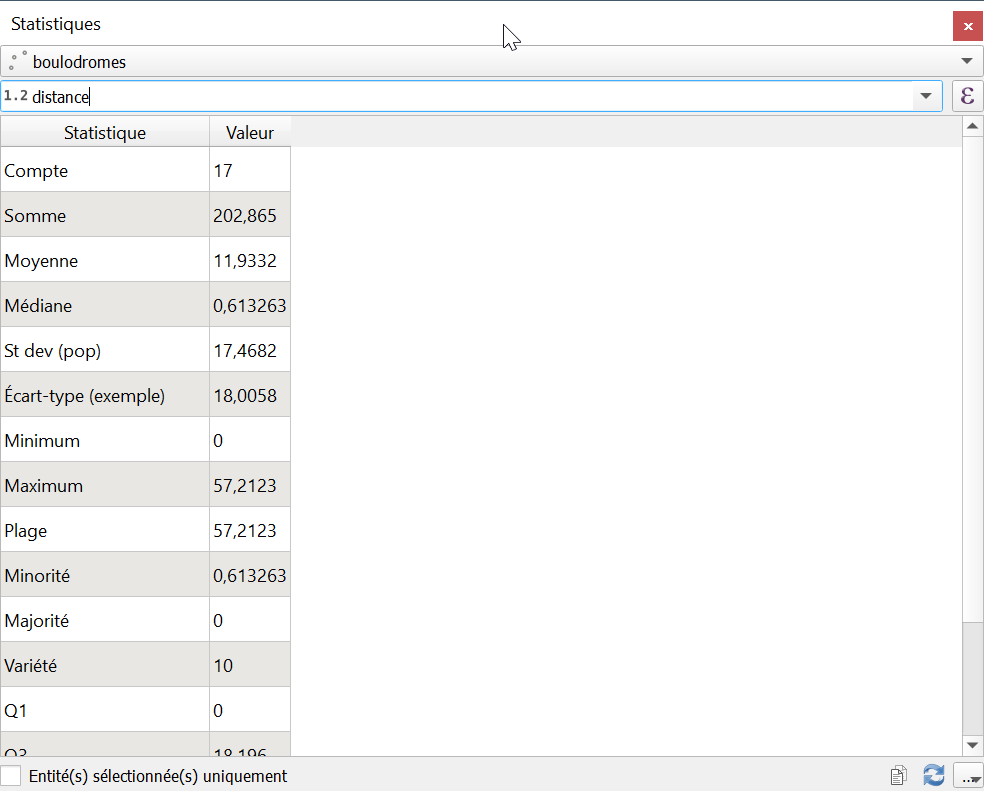

### Moyenne
On peut avoir la moyenne comme ceci :

	Vue > Panneau > Statistiques > Moyenne

On voit que la distance d'écart moyenne est de 11.7 mètres

### Filtre
On peut **filtrer** `boulodromes_equipco` selon une expression pour avoir les boulodromes avec un écart supérieur à 20 mètres. On voit que la distance max est de 57 mètres.

	distance > 20

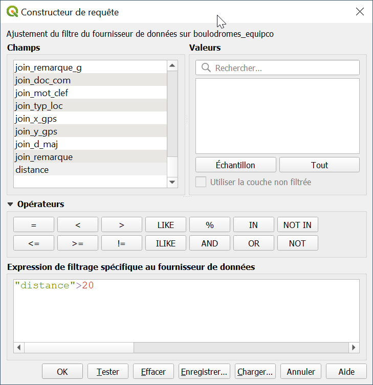

> Nous n'avons pas filtré sur boulodromes car son champ distance est virtuel et ne peut faire l'objet d'un filtre.

### Ecart à la moyenne
On peut créer un champ `ecart_a_moyenne` dans boulodromes qui comprendra l'écart à la moyenne

	distance - mean(distance)

### Ecart aux écart types
On peut faire un affichage différencié des `boulodromes` selon qu'ils sont très éloignés ou pas, par exemple avec une distance > à deux écart types

	(distance - mean(distance)) > 2*stdev(distance)

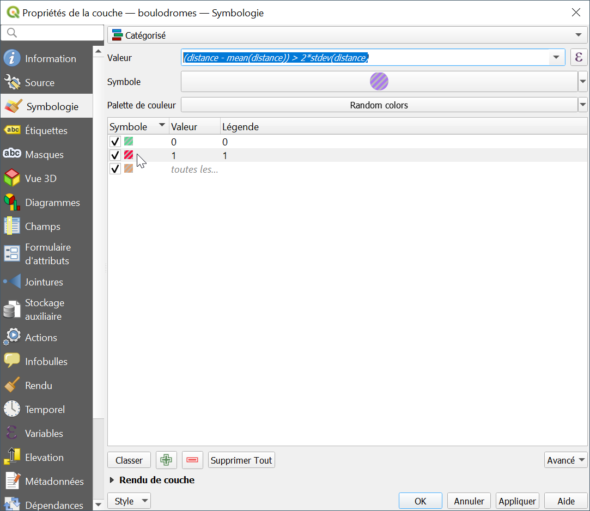

### Styles
On peut aussi afficher une taille des boules proportionnelle à la distance d'écart grâce à l'asistant de taille, dans les propriétés de taille de la boule.

1

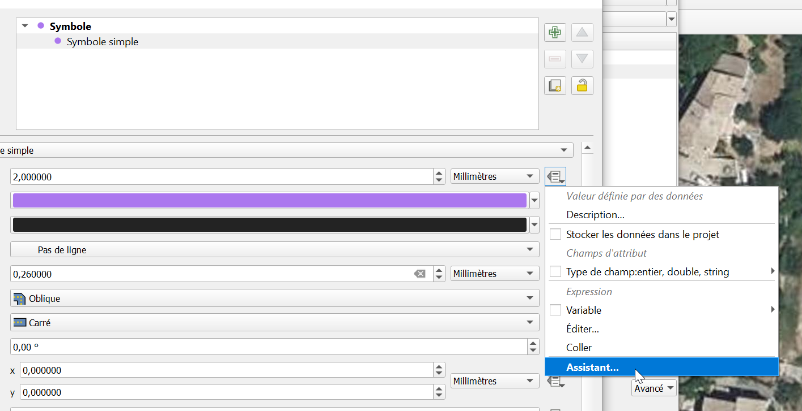

2

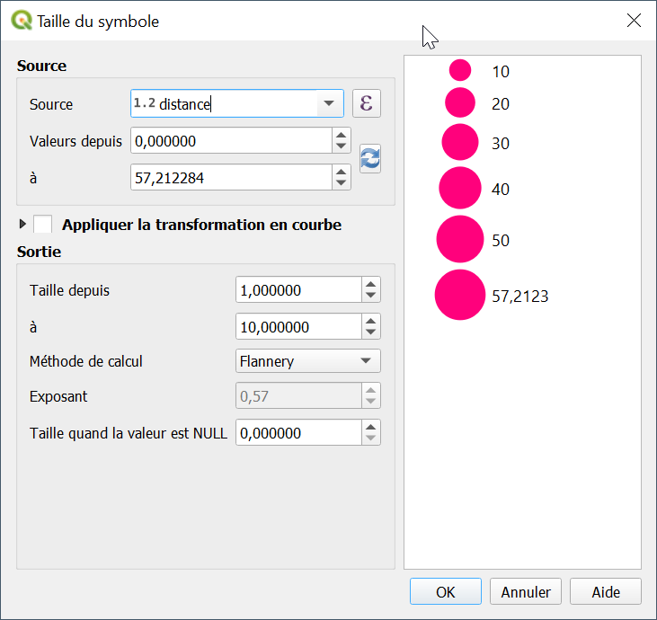

3 Voici le résultat

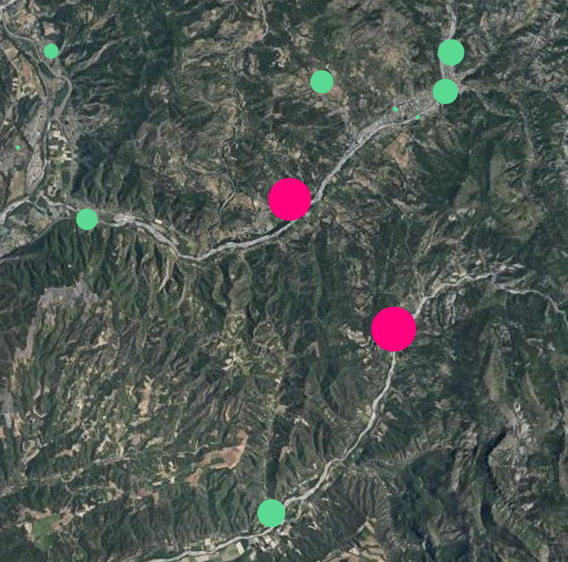

